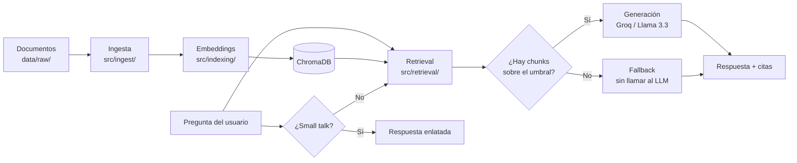
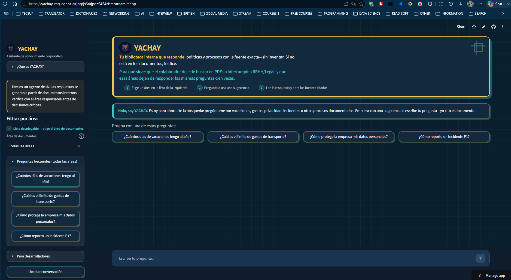
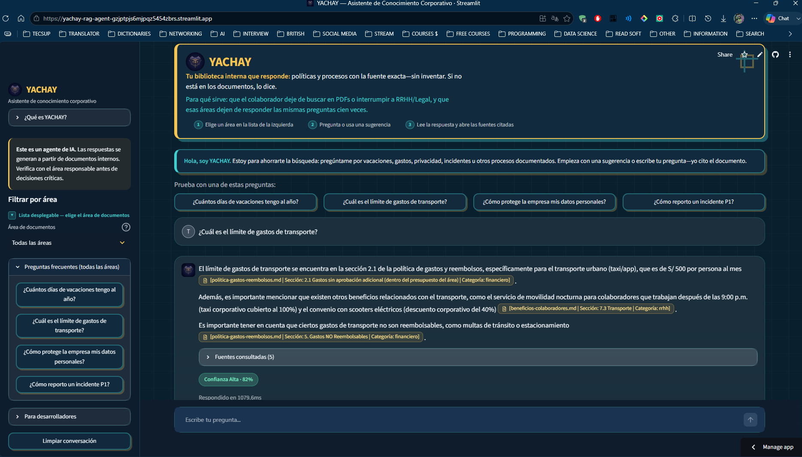
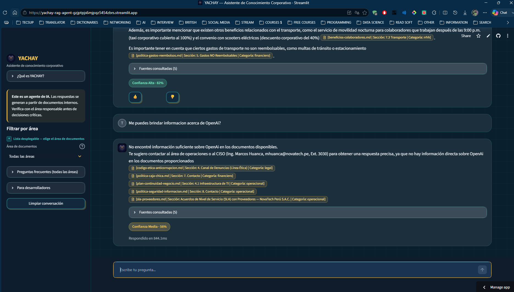
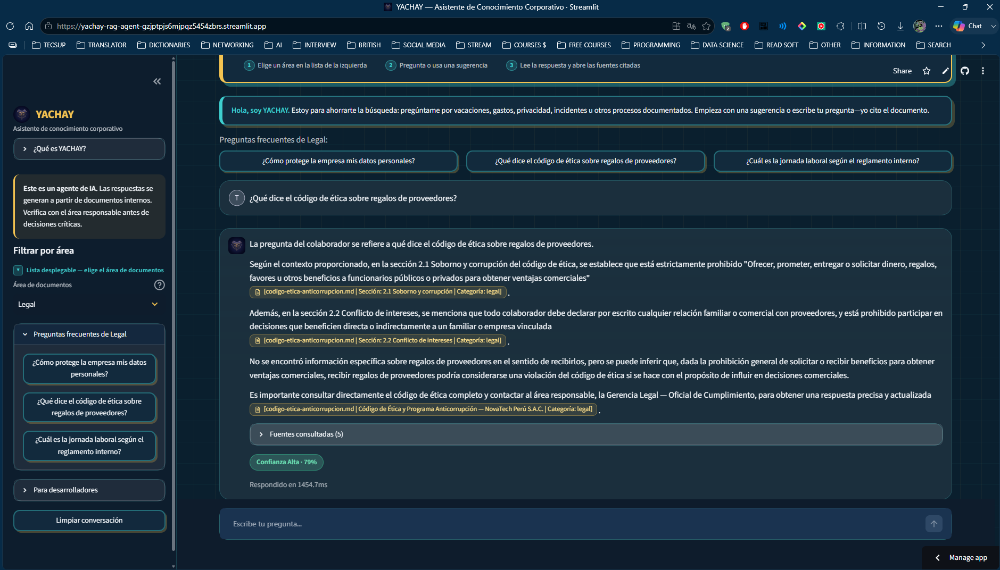

# YACHAY

> **YACHAY** (quechua: *conocimiento, saber*) — Asistente de IA que responde preguntas sobre documentos internos de la empresa, citando siempre la fuente.

## Probarlo ahora (demo en vivo)

La app está desplegada y **lista para usar** en Streamlit Community Cloud (sin instalar nada):

### 🔗 [https://yachay-rag-agent-gzjptpjs6mjpqz5454zbrs.streamlit.app/](https://yachay-rag-agent-gzjptpjs6mjpqz5454zbrs.streamlit.app/)

O con este enlace corto: **[Abrir YACHAY (demo en vivo)](https://yachay-rag-agent-gzjptpjs6mjpqz5454zbrs.streamlit.app/)**

> La primera carga puede tardar unos segundos (la app “despierta” si estuvo inactiva).

---

## 1. Descripción general del proyecto

YACHAY es un **agente RAG** (Retrieval-Augmented Generation) de conocimiento corporativo.

**Problema que resuelve:** los colaboradores pierden tiempo buscando políticas en PDFs o preguntando lo mismo a RRHH, Legal, Finanzas u Operaciones.

**Qué hace:**
1. Busca en documentos internos (políticas, manuales, procedimientos).
2. Recupera los fragmentos más relevantes.
3. Genera una respuesta en lenguaje natural **solo con esa evidencia**.
4. Cita el archivo y la sección usados.
5. Si no hay información suficiente, **lo dice** (no inventa).

Corpus de demo: 16 documentos `.md` de una empresa ficticia (**NovaTech Perú S.A.C.**), con contexto normativo peruano, en cuatro áreas: RRHH, Financiero, Legal y Operacional.

---

## 2. Arquitectura de la solución

Pipeline por etapas (feature folders), orquestado por `src/rag_engine.py`:



| Capa | Responsabilidad | Ubicación |
|---|---|---|
| UI | Chat, filtros por área, fuentes, feedback | `app/app.py` |
| Orquestación | Une retrieval + generación + atajos | `src/rag_engine.py` |
| Ingesta | Lee archivos, limpia y hace chunking | `src/ingest/` |
| Indexación | Embeddings locales + persistencia vectorial | `src/indexing/` |
| Retrieval | Búsqueda semántica + umbral de similitud | `src/retrieval/` |
| Generación | Prompt anti-alucinación, LLM, validación, small talk | `src/generation/` |
| Config | Variables de entorno y constantes | `src/config.py` |

**Decisiones clave (sin romper el flujo):**
- Si la similitud no supera el umbral → respuesta de “no encontré información” **sin gastar tokens del LLM**.
- Saludos / gracias / despedidas → respuestas enlatadas (sin retrieval ni LLM).
- El cliente LLM es intercambiable (`RemoteLLMClient` / `MockLLMClient`).

Detalle de fuentes y pivotes de deploy: [`docs/sources.md`](docs/sources.md).

---

## 3. Tecnologías y herramientas

| Pieza | Tecnología |
|---|---|
| Lenguaje | Python 3.11 |
| Interfaz | Streamlit |
| Orquestación / RAG | LlamaIndex |
| Vector store | ChromaDB (HNSW, local) |
| Embeddings | `paraphrase-multilingual-MiniLM-L12-v2` (local, ~470 MB) |
| LLM | Groq — `llama-3.3-70b-versatile` (API compatible con OpenAI) |
| OCR (opcional en docs escaneados) | Tesseract |
| Deploy | Streamlit Community Cloud |
| Logging | loguru |

> Se descartó OCI Generative AI (bloqueo al crear cuenta Free Tier) y Hugging Face Spaces con Docker (plan PRO de pago desde julio 2026). Ver `docs/sources.md`.

---

## 4. Instrucciones para ejecutar el proyecto

### Opción A — Demo en la nube (recomendado para evaluadores)

Abre: [https://yachay-rag-agent-gzjptpjs6mjpqz5454zbrs.streamlit.app/](https://yachay-rag-agent-gzjptpjs6mjpqz5454zbrs.streamlit.app/)

### Opción B — Local (Windows)

```powershell
# 1. Entorno virtual
py -3.11 -m venv venv
.\venv\Scripts\Activate.ps1

# 2. PyTorch (ajusta cu124 si no tienes GPU NVIDIA)
pip install torch torchvision torchaudio --index-url https://download.pytorch.org/whl/cu124

# 3. Dependencias del proyecto
pip install -r requirements.txt

# 4. Variables de entorno
copy .env.example .env
# Edita .env y pega tu API Key de Groq (gratis: https://console.groq.com/keys)

# 5. Indexar documentos (primera vez o si cambias data/raw/)
python scripts/ingest_documents.py

# 6. Abrir la UI
python run_app.py
```

Abre [http://localhost:8501](http://localhost:8501).

> **Windows:** usa `python run_app.py`, no `streamlit run app/app.py` directo.
> En Windows, cargar torch + ChromaDB desde el hilo de Streamlit puede cerrar el proceso.
> `run_app.py` precarga el motor en el hilo principal. En Linux/macOS ambas formas sirven.

**Sin API key:** el sistema entra en modo simulado (`MockLLMClient`): el retrieval funciona y muestra los fragmentos encontrados. Con key real, genera respuestas con Groq.

Prueba rápida por terminal:

```powershell
python scripts/test_query.py "¿Cuántos días de vacaciones tengo si llevo 3 años?"
```

---

## 5. Ejemplos de preguntas que el agente puede responder

| Área | Pregunta de ejemplo |
|---|---|
| RRHH | ¿Cuántos días de vacaciones tengo al año? |
| RRHH | ¿Puedo trabajar de forma remota? |
| Financiero | ¿Cuál es el límite de gastos de transporte? |
| Financiero | ¿Cómo reporto un gasto de caja chica? |
| Legal | ¿Cómo protege la empresa mis datos personales? |
| Legal | ¿Qué dice el código de ética sobre regalos de proveedores? |
| Operacional | ¿Cómo reporto un incidente P1? |
| Operacional | ¿Cuáles son los SLA acordados con proveedores? |
| Fuera de dominio | ¿Cuál es la receta del ceviche? *(debe decir que no sabe)* |

En la UI también aparecen sugerencias al filtrar por área en el menú lateral.

---

## 6. Ejemplos de respuestas generadas por el agente

> Las citas reales aparecen como chips en la UI (archivo · sección · categoría). Aquí se muestran en texto para el README. El contenido sigue los documentos de `data/raw/`.

### Ejemplo A — Pregunta dentro de dominio (RRHH)

**Pregunta:** ¿Cuántos días de vacaciones tengo al año?

**Respuesta (resumen tipico del agente):**

> Todo colaborador con un año completo de servicio tiene derecho a **30 días calendario** de descanso vacacional remunerado, conforme a la legislación peruana vigente.
>
> Según la antigüedad:
> - Menos de 2 años: 30 días calendario
> - De 2 a 5 años: 30 días + 2 días adicionales de libre disposición
> - Más de 5 años: 30 días + 5 días adicionales de libre disposición
>
> 📄 *[politica-vacaciones-y-permisos.md | Sección: 3.1 / 3.2 | Categoría: rrhh]*

### Ejemplo B — Pregunta dentro de dominio (Financiero)

**Pregunta:** ¿Cuál es el límite de gastos de transporte?

**Respuesta (resumen tipico):**

> El límite de **transporte urbano (taxi/app)** es de **S/ 500 por persona**, solo para traslados laborales dentro de la ciudad.
>
> 📄 *[politica-gastos-reembolsos.md | Sección: límites de gasto | Categoría: financiero]*

### Ejemplo C — Pregunta fuera de dominio (anti-alucinación)

**Pregunta:** ¿Cuál es la receta del ceviche?

**Respuesta (fallback):**

> No encontré información suficiente sobre este tema en los documentos disponibles.
>
> Te sugiero contactar al área responsable o reformular la pregunta sobre políticas, procesos o documentos internos de la empresa.

Esto demuestra que el agente **no inventa** contenido fuera del corpus.

---

## 7. Evidencias de prueba (screenshots)

Carpeta: [`docs/screenshots/`](docs/screenshots/).

Ahí puedes (o el equipo puede) guardar capturas de la demo en vivo para la revisión del challenge. Convención:

| Archivo | Qué debe mostrar |
|---|---|
| `docs/screenshots/01-home.png` | Pantalla inicial (hero + sugerencias) |
| `docs/screenshots/02-respuesta-con-fuentes.png` | Pregunta real con citas (ej. incidente P1 / vacaciones) |
| `docs/screenshots/03-fuera-de-dominio.png` | Pregunta fuera de dominio (anti-alucinación) |
| `docs/screenshots/04-filtro-area.png` | Filtro por área + preguntas frecuentes |

Instrucciones: [`docs/screenshots/README.md`](docs/screenshots/README.md).

Cuando existan los PNG, se muestran así:









**Reproducir las pruebas en la demo:**  
https://yachay-rag-agent-gzjptpjs6mjpqz5454zbrs.streamlit.app/

---

## Qué más incluye la interfaz

- Frase de valor + 3 pasos de uso en el header
- Expander **¿Qué es YACHAY?** (para colaborador vs RRHH/Legal)
- Filtro por área y preguntas frecuentes reactivas
- Fuentes consultadas + badge de confianza + feedback 👍/👎
- Guion de presentación (~2 min): [`docs/guion-demo.md`](docs/guion-demo.md)

---

## Deploy (detalle)

Demo pública:
[https://yachay-rag-agent-gzjptpjs6mjpqz5454zbrs.streamlit.app/](https://yachay-rag-agent-gzjptpjs6mjpqz5454zbrs.streamlit.app/)

Para redeployar desde GitHub en [share.streamlit.io](https://share.streamlit.io):

- Archivo principal: `app/app.py`
- Secrets (TOML):

```toml
LLM_API_KEY = "tu_api_key_de_groq"
LLM_CHAT_MODEL = "llama-3.3-70b-versatile"
LLM_BASE_URL = "https://api.groq.com/openai/v1"
LLM_PROVIDER_NAME = "Groq"
EMBEDDING_MODEL = "paraphrase-multilingual-MiniLM-L12-v2"
EMBEDDING_DIMENSION = "384"
```

Si el disco efímero se vacía, la app **reingesta sola** al detectar Chroma vacío (`src/engine_singleton.py`).

---

## Estructura del repositorio

| Carpeta / archivo | Rol |
|---|---|
| `app/app.py` | Interfaz Streamlit |
| `app/static/` | Logo (búho), avatares |
| `src/ingest/` | Lectura y chunking |
| `src/indexing/` | Embeddings + ChromaDB |
| `src/retrieval/` | Búsqueda semántica |
| `src/generation/` | LLM, prompts, small talk, validación |
| `src/rag_engine.py` | Orquestador del pipeline |
| `data/raw/` | Documentos fuente |
| `scripts/` | Ingesta y pruebas por CLI |
| `docs/` | Fuentes, guion de demo |

---

## Licencia / notas

Proyecto de demostración académica / portfolio. Las respuestas del agente **no sustituyen** la validación con el área responsable antes de decisiones críticas.
